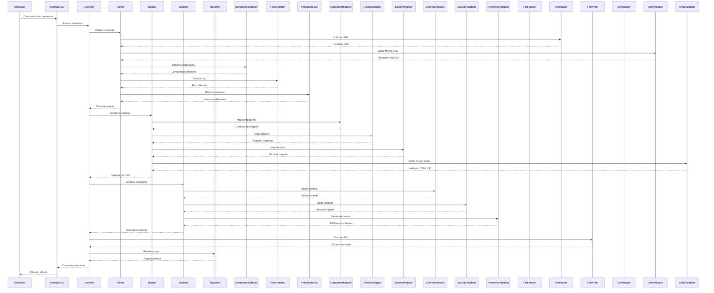

# 🔄 DrawIO to Threagile Converter

[](https://www.python.org/downloads/)
[](LICENSE)
[](https://codecov.io/gh/onyagamarcel2/drawio-to-threagile)
[](docs/usage.md)

> Un outil en ligne de commande puissant pour convertir des diagrammes d'architecture DrawIO (XML) en modèles de sécurité Threagile (YAML). Transformez facilement vos diagrammes d'architecture en modèles de menaces structurés.

## Topics

[](https://github.com/topics/drawio)
[](https://github.com/topics/threagile)
[](https://github.com/topics/security)
[](https://github.com/topics/python)
[](https://github.com/topics/cli)
[](https://github.com/topics/threat-modeling)
[](https://github.com/topics/xml)
[](https://github.com/topics/yaml)

## 📋 Table des Matières

- [Fonctionnalités](#-fonctionnalités)
- [Installation](#-installation)
- [Utilisation Rapide](#-utilisation-rapide)
- [Architecture](#-architecture)
- [Documentation](#-documentation)
- [Développement](#-développement)
- [Contribution](#-contribution)
- [Licence](#-licence)

## ✨ Fonctionnalités

- 🔄 Conversion automatique de diagrammes DrawIO XML vers YAML Threagile
- 📁 Support des fichiers et répertoires
- ✅ Validation des modèles Threagile générés
- 🔍 Détection automatique des composants et relations
- 🛡️ Mapping intelligent des attributs de sécurité
- 📊 Génération de rapports détaillés de conversion
- 📝 Journalisation complète des transformations
- ⚙️ Configuration flexible des règles de mapping

## 🚀 Installation

```bash
# Installation via pip
pip install convertisseur-xml-yaml

# Installation depuis les sources
git clone https://github.com/onyagamarcel2/convertisseur-xml-yaml.git
cd convertisseur-xml-yaml
pip install -e .
```

## 🎯 Utilisation Rapide

### Conversion XML vers YAML

```bash
# Conversion d'un fichier
convertisseur fichier.xml

# Conversion avec sortie spécifique
convertisseur fichier.xml -o sortie.yaml

# Conversion d'un répertoire
convertisseur repertoire/
```

### Conversion YAML vers XML

```bash
# Conversion d'un fichier
convertisseur fichier.yaml -r

# Conversion avec sortie spécifique
convertisseur fichier.yaml -r -o sortie.xml

# Conversion d'un répertoire
convertisseur repertoire/ -r
```

### Options Disponibles

| Option | Description |
|--------|-------------|
| `-r, --reverse` | Convertir de YAML vers XML |
| `-o, --output` | Spécifier le fichier de sortie |
| `-p, --preserve` | Préserver la structure des répertoires |
| `-m, --max-size` | Taille maximale des fichiers en Mo (défaut: 100) |
| `-v, --verbose` | Afficher les logs détaillés |
| `-l, --log-file` | Spécifier le fichier de log |

## 🏗️ Architecture

### Diagramme des Composants

```mermaid
flowchart TB
    %% Direction générale de gauche à droite
    direction LR

    %% Interface Utilisateur
    subgraph UI[Interface Utilisateur]
        direction TB
        CLI[CLI] -->|1| Config[Config]
    end

    %% Noyau de Conversion
    subgraph Core[Noyau de Conversion]
        direction TB
        Converter[Converter]
    end

    %% Processus de Conversion
    subgraph Process[Processus de Conversion]
        direction TB
        Parser[DrawIO Parser]
        Mapper[Threagile Mapper]
        Validator[Threagile Validator]
        Reporter[Reporter]
    end

    %% Détection
    subgraph Detection[Détection]
        direction TB
        ComponentDetector[Component Detector]
        FlowDetector[Flow Detector]
        ThreatDetector[Threat Detector]
        CompositeManager[Composite Manager]
        StyleAnalyzer[Style Analyzer]
        ContextManager[Context Manager]
    end

    %% Mapping
    subgraph Mapping[Mapping]
        direction TB
        ComponentMapper[Component Mapper]
        RelationMapper[Relation Mapper]
        SecurityMapper[Security Mapper]
        TypeMapper[Type Mapper]
        AttributeMapper[Attribute Mapper]
        SecurityLevelMapper[Security Level Mapper]
        ComplianceMapper[Compliance Mapper]
    end

    %% Validation
    subgraph Validation[Validation]
        direction TB
        SchemaValidator[Schema Validator]
        SecurityValidator[Security Validator]
        ReferenceValidator[Reference Validator]
        NamingValidator[Naming Validator]
        StructureValidator[Structure Validator]
        CIAValidator[CIA Validator]
        ControlValidator[Control Validator]
        XMLValidator[XML Validator]
        YAMLValidator[YAML Validator]
    end

    %% Gestion des Fichiers
    subgraph FileMgmt[Gestion des Fichiers]
        direction TB
        FileHandler[File Handler]
        FileReader[File Reader]
        FileWriter[File Writer]
        DirManager[Directory Manager]
    end

    %% Ressources
    subgraph Resources[Ressources]
        direction TB
        Files[Files]
        Dirs[Dirs]
        XML[XML]
        YAML[YAML]
    end

    %% Flux principaux
    UI -->|2| Core
    Core -->|3| Process
    Process -->|4| Detection
    Process -->|5| Mapping
    Process -->|6| Validation
    Process -->|7| FileMgmt
    FileMgmt -->|8| Resources

    %% Flux de Parsing
    Parser -->|9| ComponentDetector
    Parser -->|10| FlowDetector
    Parser -->|11| ThreatDetector
    Parser -->|12| FileReader
    Parser -->|13| XMLValidator

    %% Flux de Mapping
    Mapper -->|14| ComponentMapper
    Mapper -->|15| RelationMapper
    Mapper -->|16| SecurityMapper
    Mapper -->|17| FileWriter
    Mapper -->|18| YAMLValidator

    %% Flux de Validation
    Validator -->|19| SchemaValidator
    Validator -->|20| SecurityValidator
    Validator -->|21| ReferenceValidator
    Validator -->|22| XMLValidator
    Validator -->|23| YAMLValidator

    %% Flux de Détection
    ComponentDetector -->|24| CompositeManager
    ComponentDetector -->|25| StyleAnalyzer
    ComponentDetector -->|26| ContextManager

    %% Flux de Mapping
    ComponentMapper -->|27| TypeMapper
    ComponentMapper -->|28| AttributeMapper
    SecurityMapper -->|29| SecurityLevelMapper
    SecurityMapper -->|30| ComplianceMapper

    %% Flux de Validation
    SchemaValidator -->|31| NamingValidator
    SchemaValidator -->|32| StructureValidator
    SecurityValidator -->|33| CIAValidator
    SecurityValidator -->|34| ControlValidator

    %% Flux de Gestion des Fichiers
    FileHandler -->|35| FileReader
    FileHandler -->|36| FileWriter
    FileHandler -->|37| DirManager

    %% Flux vers les Ressources
    FileReader -->|38| Files
    FileWriter -->|39| Files
    DirManager -->|40| Dirs
    XMLValidator -->|41| XML
    YAMLValidator -->|42| YAML

    %% Styles
    classDef primary fill:#f9f,stroke:#333,stroke-width:2px
    classDef secondary fill:#bbf,stroke:#333,stroke-width:2px
    classDef tertiary fill:#bfb,stroke:#333,stroke-width:2px
    classDef resource fill:#fbb,stroke:#333,stroke-width:2px
    
    class CLI,Converter primary
    class Parser,Mapper,Validator secondary
    class ComponentDetector,ComponentMapper,SecurityMapper tertiary
    class Files,Dirs,XML,YAML resource
```



### Diagramme de Séquence



## 📚 Documentation

### Guides Disponibles

- 📖 [Guide d'utilisation](docs/usage.md) - Guide complet d'utilisation
- 📋 [Formats supportés](docs/formats.md) - Détails des formats supportés
- 👥 [Guide de contribution](docs/contribution.md) - Comment contribuer

### Exemples d'Utilisation

<details>
<summary>Exemple de Conversion Simple</summary>

```bash
# Conversion XML vers YAML
convertisseur config.xml

# Conversion YAML vers XML
convertisseur config.yaml -r
```
</details>

<details>
<summary>Exemple de Conversion avec Structure Préservée</summary>

```bash
# Préserver la structure des répertoires
convertisseur src/ -p -o output/
```
</details>

<details>
<summary>Exemple de Conversion avec Limite de Taille</summary>

```bash
# Limiter la taille des fichiers à 50 Mo
convertisseur data/ -m 50
```
</details>

## 💻 Développement

### Prérequis

- Python 3.8+
- pip
- virtualenv (recommandé)

### Installation des Dépendances

```bash
# Installation des dépendances de développement
pip install -r requirements.txt
```

### Tests

```bash
# Exécuter les tests
pytest

# Exécuter les tests avec couverture
pytest --cov=convertisseur_xml_yaml

# Vérifier le style du code
flake8
black .
mypy .

# Vérifier la sécurité
bandit -r .

# Vérifier la documentation
pydocstyle .
```

## 🤝 Contribution

Les contributions sont les bienvenues ! Consultez notre [guide de contribution](docs/contribution.md) pour plus de détails.

1. Fork le projet
2. Créez votre branche de fonctionnalité (`git checkout -b feature/AmazingFeature`)
3. Committez vos changements (`git commit -m 'Add some AmazingFeature'`)
4. Poussez vers la branche (`git push origin feature/AmazingFeature`)
5. Ouvrez une Pull Request

## 📄 Licence

Ce projet est sous licence MIT. Voir le fichier [LICENSE](LICENSE) pour plus de détails.

---

<div align="center">
  <sub>Construit avec ❤️ par <a href="https://github.com/onyagamarcel2">Marcel ONYAGA</a></sub>
</div> 