# 🔄 Convertisseur XML/YAML

[](https://www.python.org/downloads/)
[](LICENSE)
[](https://codecov.io/gh/onyagamarcel2/convertisseur-xml-yaml)
[](docs/usage.md)

> Un outil en ligne de commande puissant pour convertir des fichiers entre les formats XML et YAML.

## Topics

[](https://github.com/topics/xml)
[](https://github.com/topics/yaml)
[](https://github.com/topics/converter)
[](https://github.com/topics/python)
[](https://github.com/topics/cli)
[](https://github.com/topics/data-conversion)
[](https://github.com/topics/file-processing)
[](https://github.com/topics/format-conversion)

## 📋 Table des Matières

- [Fonctionnalités](#-fonctionnalités)
- [Installation](#-installation)
- [Utilisation Rapide](#-utilisation-rapide)
- [Architecture](#-architecture)
- [Documentation](#-documentation)
- [Développement](#-développement)
- [Contribution](#-contribution)
- [Licence](#-licence)

## ✨ Fonctionnalités

- 🔄 Conversion bidirectionnelle (XML ↔ YAML)
- 📁 Support des fichiers et répertoires
- 📝 Entrée/sortie standard
- 📂 Préservation de la structure des répertoires
- ✅ Validation des formats
- 📊 Vérification de la taille des fichiers
- 📝 Journalisation détaillée
- 🛡️ Gestion robuste des erreurs

## 🚀 Installation

```bash
# Installation via pip
pip install convertisseur-xml-yaml

# Installation depuis les sources
git clone https://github.com/onyagamarcel2/convertisseur-xml-yaml.git
cd convertisseur-xml-yaml
pip install -e .
```

## 🎯 Utilisation Rapide

### Conversion XML vers YAML

```bash
# Conversion d'un fichier
convertisseur fichier.xml

# Conversion avec sortie spécifique
convertisseur fichier.xml -o sortie.yaml

# Conversion d'un répertoire
convertisseur repertoire/
```

### Conversion YAML vers XML

```bash
# Conversion d'un fichier
convertisseur fichier.yaml -r

# Conversion avec sortie spécifique
convertisseur fichier.yaml -r -o sortie.xml

# Conversion d'un répertoire
convertisseur repertoire/ -r
```

### Options Disponibles

| Option | Description |
|--------|-------------|
| `-r, --reverse` | Convertir de YAML vers XML |
| `-o, --output` | Spécifier le fichier de sortie |
| `-p, --preserve` | Préserver la structure des répertoires |
| `-m, --max-size` | Taille maximale des fichiers en Mo (défaut: 100) |
| `-v, --verbose` | Afficher les logs détaillés |
| `-l, --log-file` | Spécifier le fichier de log |

## 🏗️ Architecture

### Diagramme des Composants


### Diagramme de Séquence

```mermaid
sequenceDiagram
    participant U as Utilisateur
    participant CLI as Interface CLI
    participant C as Convertisseur
    participant V as Validateur
    participant F as Gestionnaire Fichiers
    participant E as Gestionnaire Erreurs
    participant L as Logger

    U->>CLI: Commande de conversion
    CLI->>L: Log début conversion
    CLI->>F: Vérifie fichier
    F-->>CLI: Statut fichier
    CLI->>C: Lance conversion
    C->>F: Lit fichier
    F-->>C: Contenu
    C->>V: Valide format
    V-->>C: Résultat validation
    alt Format valide
        C->>C: Convertit
        C->>F: Écrit résultat
        F-->>C: Confirmation
        C->>L: Log succès
        C-->>CLI: Succès
    else Format invalide
        C->>E: Signale erreur
        E->>L: Log erreur
        E-->>CLI: Message erreur
    end
    CLI->>L: Log fin conversion
    CLI-->>U: Résultat
```



## 📚 Documentation

### Guides Disponibles

- 📖 [Guide d'utilisation](docs/usage.md) - Guide complet d'utilisation
- 📋 [Formats supportés](docs/formats.md) - Détails des formats supportés
- 👥 [Guide de contribution](docs/contribution.md) - Comment contribuer

### Exemples d'Utilisation

<details>
<summary>Exemple de Conversion Simple</summary>

```bash
# Conversion XML vers YAML
convertisseur config.xml

# Conversion YAML vers XML
convertisseur config.yaml -r
```
</details>

<details>
<summary>Exemple de Conversion avec Structure Préservée</summary>

```bash
# Préserver la structure des répertoires
convertisseur src/ -p -o output/
```
</details>

<details>
<summary>Exemple de Conversion avec Limite de Taille</summary>

```bash
# Limiter la taille des fichiers à 50 Mo
convertisseur data/ -m 50
```
</details>

## 💻 Développement

### Prérequis

- Python 3.8+
- pip
- virtualenv (recommandé)

### Installation des Dépendances

```bash
# Installation des dépendances de développement
pip install -r requirements.txt
```

### Tests

```bash
# Exécuter les tests
pytest

# Exécuter les tests avec couverture
pytest --cov=convertisseur_xml_yaml

# Vérifier le style du code
flake8
black .
mypy .

# Vérifier la sécurité
bandit -r .

# Vérifier la documentation
pydocstyle .
```

## 🤝 Contribution

Les contributions sont les bienvenues ! Consultez notre [guide de contribution](docs/contribution.md) pour plus de détails.

1. Fork le projet
2. Créez votre branche de fonctionnalité (`git checkout -b feature/AmazingFeature`)
3. Committez vos changements (`git commit -m 'Add some AmazingFeature'`)
4. Poussez vers la branche (`git push origin feature/AmazingFeature`)
5. Ouvrez une Pull Request

## 📄 Licence

Ce projet est sous licence MIT. Voir le fichier [LICENSE](LICENSE) pour plus de détails.

---

<div align="center">
  <sub>Construit avec ❤️ par <a href="https://github.com/onyagamarcel2">Marcel ONYAGA</a></sub>
</div> 